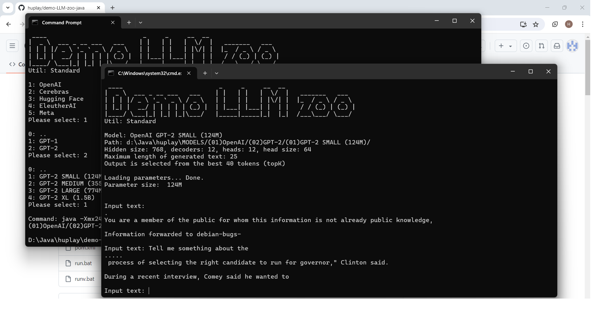

# Demo LLM zoo Java

This is a demo application which implements different LLM (Large Language Model) architectures like GPT-1, GPT-2 and Llama in Java, for learning purposes.

The goal is to demonstrate the different decoder-only transformer architectures (without training), not to create an optimized application.

TensorFlow, Pytorch or similar tools are NOT used. The core mathematical utility is implemented in three versions, you can select which one to use.



## Install ##

1. Download and unzip this module: https://github.com/huplay/demo-LLM-zoo-java

   (Or using git: ```git clone https://github.com/huplay/demo-LLM-zoo-java.git```)

2. Install Java. (At least version 1.8, but using Vector API utility requires Java 18 or above. Tested on Java 20, 22.)

3. Using a command line tool (`cmd`) enter into the main directory:

   ```cd demo-LLM-zoo-java```

   And start the app:

   ```run``` (On Windows)

## Trained parameters ##

The parameter files should be provided in `safetensors` file format, but the app can download these from the configured repository.

## Configuration ##

Every ported model has a subfolder within the `modelConfig` folder. (Organised in subfolders.) A `model.properties` file describes all details to use the model, or to download it.

It is possible to create a new folder with a new `model.properties` file, to specify a new model.

Main config:
- `name`: Name of the model
- `transformer.type`: Transformer implementation (ORIGINAL_TRANSFORMER / OPENAI_GPT_1 / OPENAI_GPT_2 / BIG_SCIENCE_BLOOM / ELEUTHERAI_NEO / META_LLAMA)
- `hidden.size`: Hidden size (embedding size)
- `feedforward.size`: Size of the feed-forward layer
- `decoder.count`: Number of decoders
- `attention.head.count`: Number of heads
- `epsilon`: Epsilon used by normalisation

Tokenizer config:
- `tokenizer`: Tokenizer type (GPT-1, GPT-2, SentencePiece, Tiktoken)
- `tokenizer.config`: Folder name within the `tokenizerConfig` containing the parameters for the tokenizer
- `token.count`: Number of tokens
- `end.of.text.token`: Id of the token marking the end of the text (Generation stops on that)
- `max.length`: Maximum number of tokens to process (context size)

Parameter config:
- `parameter.repo`: URL of the repo, containing the parameter files (Only Hugging Face is supported)
- `parameter.repo.branch`: branch name where the parameters are added (if missing: main)
- `parameter.files`: list of parameter files (must be in `safetensors` format)
- `transformer.parameter.format`: template for the transformer level parameters, `{name}` is replaced by the string used in code
- `decoder.parameter.format`: template for the decoder level parameters, `{decoderId}` and `{name}` is replaced
- `transformer.parameter.overrides`: (Optional) If the actual model has a different parameter name to that string used in the code, you can provide the mapping. (This is a comma separated list, every entry is colon separeted pair. <original name>: <actual name>)
- `decoder.parameter.overrides`: (Optional) Same as the previous, but for decoder level parameters

## Supported Transformer types ##

The Transformer implementations can be found in the `transformer` package. Path: `app/src/main/java/huplay/demo/transformer`.

Every transformer is implemented via two classes. One is a subclass of the `BaseTransformer`, the second is a subclass of the `BaseDecoder`.

The is no logic in the base classes, these are just helpers to store and access the configuration, the parameters and so on.

The following transformer architectures are implemented:

- `ORIGINAL_TRANSFORMER`: The first transformer, created by Google Brain in 2017. Described in the `Attention Is All You Need` paper. (The trained parameters are not published.)
- `OPENAI_GPT_1`: The first GPT created by OpenAI, released in June 2018. (Based on the Google's unpublished model, described in the `Attention Is All You Need` paper)
- `OPENAI_GPT_2`: The second GPT created by OpenAI, limited release in Feb 2019, full access in Nov 2019. Minor differences to GPT-1, only related to the normalization.
- `ELEUTHERAI_NEO`: First GPT implementation by EleutherAI, released in 2021. Almost the same as GPT-2 and GPT-3, few unimportant differences. 
- `BIG_SCIENCE_BLOOM`: Created by an open community organised by Hugging Face to create a similar model to GPT-3. Released in March-July 2022. The main difference to GPT-2/GPT-3 is the Alibi position embedding.
- `META_LLAMA`: Created by Meta (Facebook), released in Feb 2023. Currently only the original architecture is supported, but the latest models use Grouped Query Attention. Changes to GPT-2: Rotary position embedding, 3 layered MLP block, Swiglu activation function, RSM normalisation.

## For developers ##

Steps is you want to modify and rebuild the app:

1. Install Maven. (Java compile/build tool) (3.8.6 used during development).

2. Compile (build) the application. There are 3 possibilities, based on that which utility implementation you want to use.
   Standard: 

   ```mvn clean install```

   Using Nd4j:

   ```mvn clean install -Pnd4j```

   Using Java Vector API:

   ```mvn clean install -Pvector-api```


## Customization ##

At default the parameter files are downloaded to the model's configuration folder within ```modelConfig```. You can specify a different folder using the ```DEMO_LLM_ZOO_MODEL_ROOT``` environment variable.

Without using the menu, you can directly select the model, where the ```<model-name>``` is the full path within the model root:

   ```run <model-name>``` (On Windows)
    
Or on any systems:```java -jar target/demo-LLM-zoo.jar <model-name>```

(To specify the order the folders has a (nn) prefix, which is removed when the folder name is displayed, but it is part of the model path.)

If you want to use the Vector API version (in the case you installed that variant) you have to use the ``runv <model-name>`` command.
This is necessary because the Vector API isn't ready (as of Java 20), added only as an incubator module, so we have to execute the Java Virtual Machine telling we want to use this incubator feature. 
  
## Additional command line parameters ##

- `-max` - Maximum number of generated tokens (default: 25)
- `-topK` - Number of possibilities to chose from as next token (default: 40)
- `-calc` - Calculation only (without executing the model, it just displays the parameter size)

Example:

`run GPT2/XL -max=1024 -topk=100`

## Usage ##

Actually there are two applications. The launcher app implements the model selection, which opens the main app in a separate window.

It is necessary to setup the correct heap size (memory) for the main app, which depends on the selected model.

The main app shows a prompt, where you can provide a text:

```Input text:```

You can leave it empty, or type something, which will be continued by the system. While the input tokens are processed a `.` character is displayed. (One for every token.)
After that the system prints the generated tokens (one by one). If the maximum length is reached, or the response finished by an `END-OF-TEXT` token, a new prompt will be given.

Normally every prompt starts a completely new session (the state is cleared), but if you want to remain in the same context, start your input text by `+`.
If you use only a single `+` character, without more content, the system will continue the text as it would do without the limit of the max length.

To quit press Ctrl + C.

If the response contained special unicode characters, where a single character is constructed using multiple tokens, then the "one by one" printing solution will show "?" characters. But after the text is fully generated the whole text will be printed again to show the correct characters. (Only at cases when the original print wasn't perfect.) 


## Tokenizer ##

All LLMs use a byte pair encoding logic, but there are different versions.

Supported tokenizers: 
   - GPT-1
   - GPT-2 (used by GPT-3 as well), and for BLOOM with different vocabulary
   - SentencePiece (used by Llama1 and Llama2)
